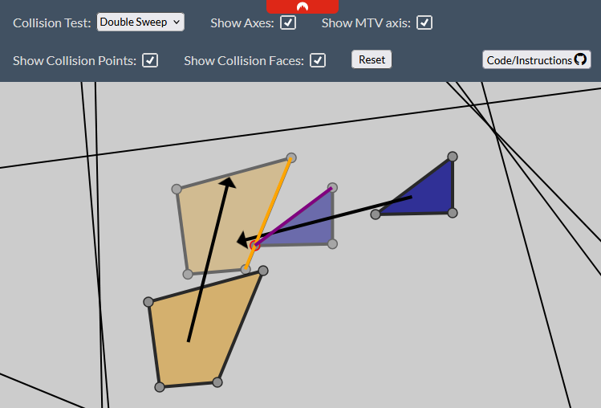

# SAT Playground

This is meant as an easy way to showcase and understand the SAT collision detection algorithm.  

Visit the [live page](https://sat.lapinozz.com)  

Some things you can try: 

* Move drag the shapes to move them
* You can modify the shape by dragging the points
* double click on an edge to add a point
* double click on a point to remove it

Make sure to keep your shapes convex, the algorithm doesn't work on concave shape  
if you make a shape concave it'll become red to warn you  

You can hover on one of the axis around the shapes to see the projection of the shapes on that axis  
It will also show which of the shape's edges this axis comes from  

You can change the collision mode to "sweep" or "double sweep" for the detection collision of moving objects  
In that mode you'll be able to modify the velocity of shape(s) by dragging the head of the arrow  
